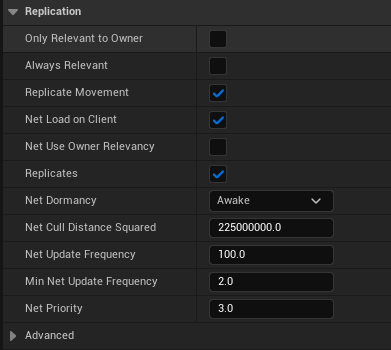

# Quick Setup

After installing, through the Epic Games Launcher or otherwise, let's walk through the steps to get started.

## Stamina Component

To add the Stamina functionality to an actor, simply add the [Stamina Component](/docs/C%2B%2BClasses/StaminaComponent.md) to the actor. If you want to replicate it, make sure that the actor itself is replicated. The component should be replicated by default.

The sprinting is much of the same, just add the [Sprint Component](/docs/C%2B%2BClasses/SprintComponent.md) and make sure that it is replicating by default. Here is where you can set the decay rate and how fast you want the character to sprint. You also want to ensure that you have the [Sprint Component Interface](/docs/C%2B%2BClasses/SprintComponentInterface.md) implemented on the actor, so you can define which [Stamina Component](/docs/C%2B%2BClasses/StaminaComponent.md) and Character Movement Component the [Sprint Component](/docs/C%2B%2BClasses/SprintComponent.md) should use. If you are using both on a character then you may not need to use the interface but it is still recommended. 

From here, you should be able to bind any inputs to the `Server_ToggleSprintActive` RPC to allow your character to sprint.  

If you are having any issues with getting this setup, please have a look at the example character included in the plugin. 
